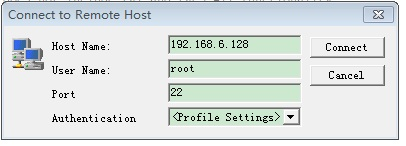
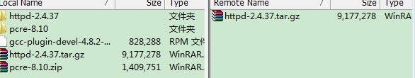
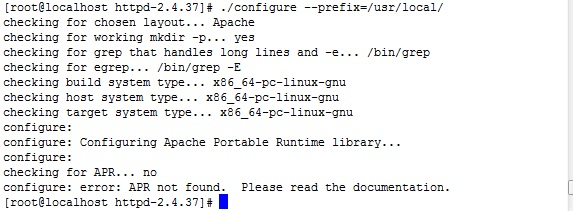
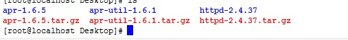
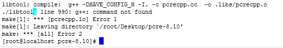
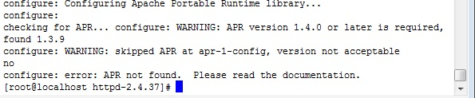
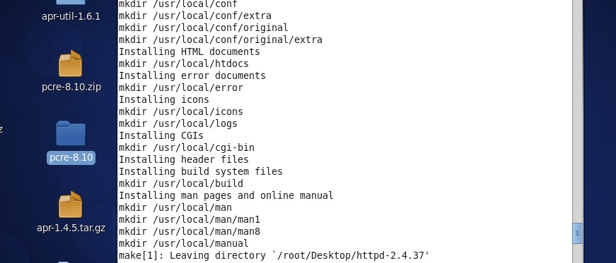
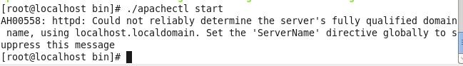
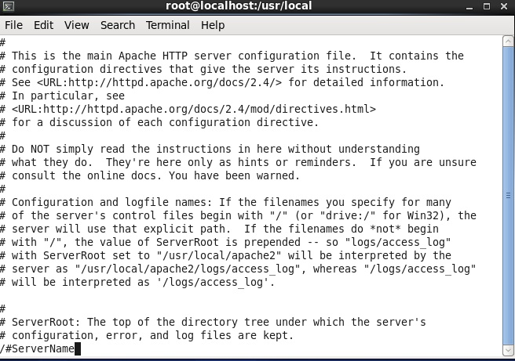
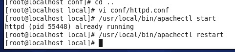

### 1.首先需要下载好安装套件（yum groupinstall "Development Tools"）然后在网上下载好apache的安装包,（这里使用下载的是源码压缩包，名字为httpd-2.4.37.tar.gz）
     
### 2.把httpd-2.4.37.tar.gz传到虚拟机中，我用的是centOS7。
  * 这里为了把文件传到linux，使用了openssh连接虚拟机
  * 
  * 通过openssh把文件传到centOS桌面上
  * 
### 3.用源码方式安装httpd（apache）--step1：解压-->step2：configure-->解决依赖-->step3：make-->step4：make install，这里的详细操作步骤及我遇到的问题如下：
  * 用tar -zxvf解压httpd-2.4.37.tar.gz，在桌面上生成了一个httpd-2.4.37 文件夹，cd进入文件夹
  * 运行./configure --prefix=/usr/local/
  * 报错：依赖问题需要解决，提示的是缺少APR组件

  * 秉承着有问题找百度的精神，我找了一篇帖子...[地址](https://www.cnblogs.com/xdouby/p/6406873.html)
  * 下载并解压apr-1.6.5.tar.gz  apr-util-1.6.1.tar.gz 两个文件，开始安装

  * （这里再啰嗦一下源码文件通用的安装思路）解压文件-->进入解压生成的文件夹-->./configure -->make&&make install
  * 我在安装apr-util的时候文件损坏了，所以用yum安装了这个文件
  * 依然要解决依赖，下载pcre-8.10.zip文件用openssh传到虚拟机（注意文件用unzip解压）

 * 应该是缺少gcc组件
    yum install -y gcc gcc-c++
  * 问题解决
  * 回到httpd-2.4.37文件夹，cd进入用./configure --/usr/local/命令继续安装step2的操作，再次报错

    ./configure --prefix=/usr/local命令指定路径
  接下来还要重新安装apr-util-1.6.1，./configure继续报错error: APR could not be located. Please use the --with-apr option.里面说的意思应该是apr-util-1.6.1运行需要apr-1.4.5目录（也就是上一个软件安装目录）的支持所以我们执行命令[root@localhost apr-util-1.6.1]# ./configure --with-apr来执行，成功完成
------
  * 回到httpd目录继续执行./configure --prefix=/usr/local/命令，继续报错。。。error1，不知道为什么，
百度了半天没有头绪，我就猜是不是报错本身是错误的，所以继续输入make install，神奇的是竟然没有报错

漫长的安装过程终于结束了
### 4.关闭防火墙，启动Apache服务
  * centos 7关防火墙：systemctl stop firewalld; centos 6关防火墙：service iptables stop
  * 启动Apache服务的方法：安装的根目录/usr/local/apache2/bin/apachectl start(可以再输入一次"路径 restart")
  * 启动Apache服务/usr/local/bin/apachectl start又报错了
 
  * 这个好解决，cd进入apache目录下的htdocs目录，编辑httpd.conf文件vi conf/httpd.conf 在里面搜索#ServerName 把前面的注释符号#去掉保存
 
  * 现在再次启动apache服务```/usr/local/bin/apachectl start``````/usr/local/bin/apachectl restart```

### 5.输入虚拟机IP地址来试一下新建的网站吧（我在这就在虚拟机中测试一下）
```[root@localhost Desktop]# curl 192.168.11.147```
```<html><body><h1>It works!</h1></body></html>```
  * 实际的图在这
### 6.终于到了最后一步，是不是很好奇刚才打开的网页文件存放在哪儿呢？其实它就在刚才安装的根目录/usr/local/apache2/htdocs里面安静的呆着呢，试着用我们自己喜欢的网站成品文件替换index.heml，然后再次访问虚拟机的ip地址，是不是一个个人专属的Apache网站就搭建好了哈哈。日记到这里就结束了，明天继续更新


    
