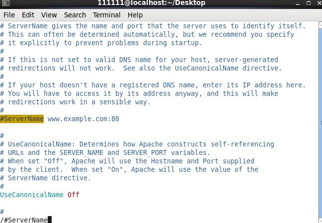
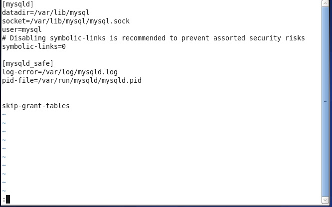
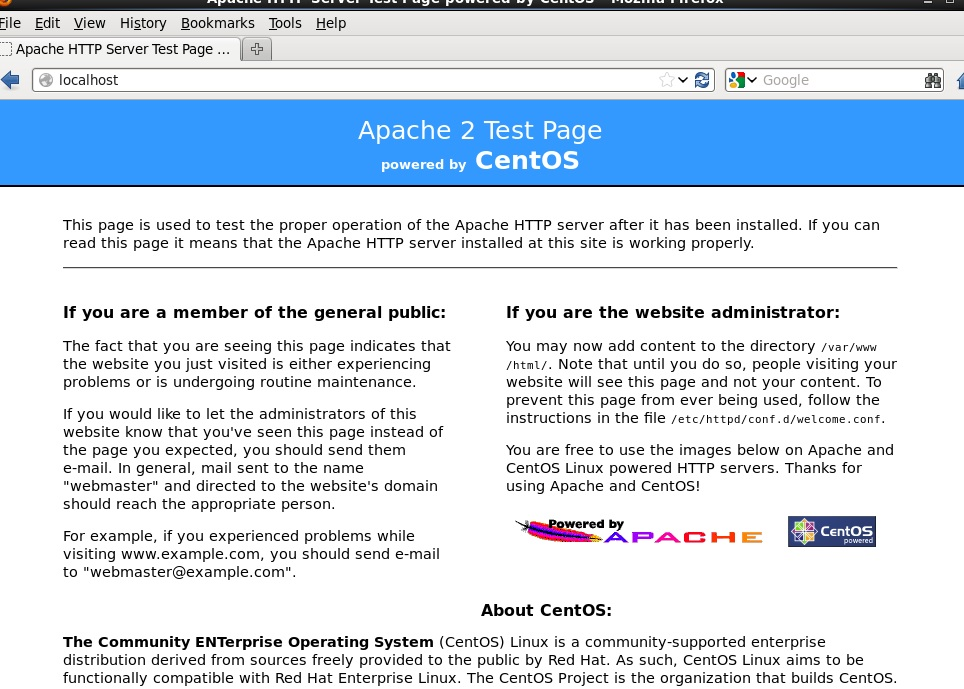
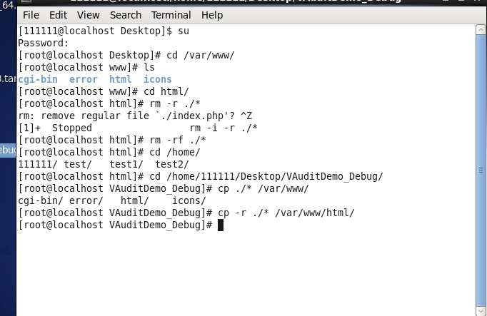
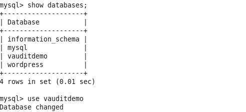
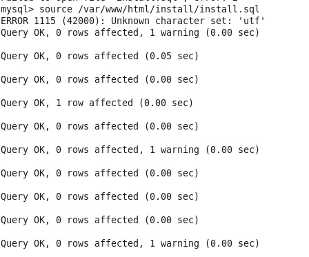

## l---linux；A---Apache；M---mysql;P---PHP;
## Apache是一款web服务器，mysql是多线程、多用户管理系统，PHP可以用来编写网站源代码，作为Apache的扩展，今天的主题就是如何搭建一款LAMP环境。
------
### Apache：

* 1.安装yum install httpd httpd-devel httpd-menaul mod_ssl mod_perl mod_auth_mysql -y

* 2.启动服务service httpd start

* 3.更改servername（vi /etc/httpd/conf/httpd.conf）

* 4.重启apache服务：service httpd restart

* 5.启动Apache服务service httpd start

* 6.设置开机自启动chkconfig httpd on

------
### mysql:

* 1.安装yum install mysql-server mysql -y

* 2.设置mysql开机启动chkconfig mysqld on

* 3.启动服务service mysqld start

* 4.mysql服务初始化 mysql_secure_installation（如果默认有密码，在/etc/my.cnf中加入参数skip-grant-tables然后在输入密码阶段，直接回车登陆）

------
### PHP：

* 1.安装yum install php php-mysql php-gd libjpeg* php-imap php-ldap php-odbc php-pear php-xml php-xmlrpc php-mbstring php-mcrypt php-bcmath php-mhash libmcrypt -y

* 2.修改PHP配置文件vi  /etc/httpd/conf/httpd.conf

* 3.重启apache服务： service httpd restart

* 4.打开网页输入localhost即可看到效果

* 5.把自己做好的网页文件传入/var/www/html目录下，再打开网页

* 6.打开mysql，选择数据库use vauditdemo；
    

* 7.用source /var/www/html/install/install.sql命令导入数据库文件

