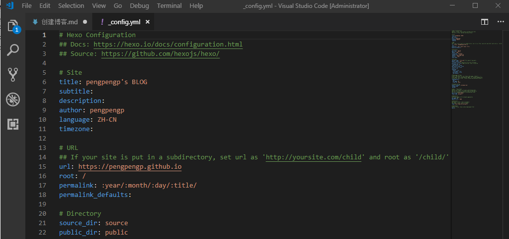
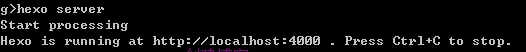
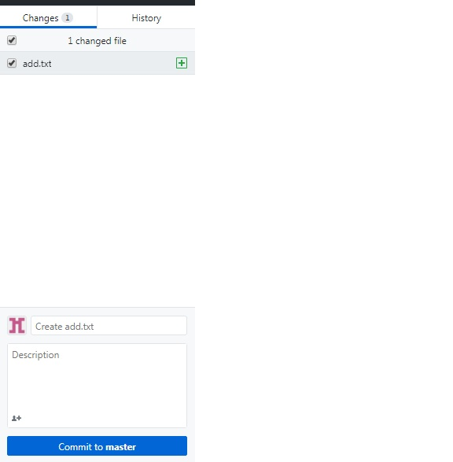
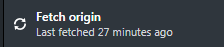

***
 ## 先期准备工作：配置.net   安装shadowsocks（代理服务器）
*****
### 1.github安装注册，下载githubDesktop（同步工具）     

### 2.下载node.js安装包[node.js官网](https://nodejs.org/en/)

    *    安装好node.js后可以cmd中运行npm试试安装成功了没   （node.js安装软件用的命令）

### 3.下载git（百度搜git官网）或点击[git官网](https://git-scm.com/)并在硬盘中创建一个自己博客的目录（例：c：\blog），然后在目录中用cmd命令行安装hexo并初始化文件夹，hexo安装和文件夹初始化方法如下：
    *   安装hexo的方法：在文件夹地址栏中把地址改为cmd然后回车打开cmd窗口， 运行 npm install -g hexo-cli命令  
    安装hexo（hexo.io）（hexo是自动生成网页的工具） 

    *   还是在d:\blog目录打开cmd命令行输入hexo init.回车， 来初始化你博客目录

### 4.用VS编辑软件打开d：\blog  ,选择_config.yml，把url改成自己的博客地址
 
 
### 5.申请自己的博客仓库（域名）*注意：必须是注册名.github.io的格式否则无法访问*[（www.github.com）](https://github.com/)，仓库创建也可以在注册github时操作。
### 6.利用素材生成网页文件包（即生成/public目录）；hexo目录包含三个重点文件夹：theme主题、source内容、public网站成品
    *  cmd窗口中 执行hexo  generate来生成/public文件夹（做好的网页文件夹） 然后执行hexo  server
    来启动你的服务器,提示hexo运行的地址localhost：4000，在浏览器中输入localhost：4000即可看到你创建的页面
   

### 7.登录gitHub desktop 客户端   克隆刚才的路径（界面最右侧有个“clone”按钮，打开选择你之前创建的域名）来下载你网页文件到本地硬盘（这里要记住保存的路径，方便之后替换）

    *   先用克隆的方法下载网页文件到本地路径（默认下载到我的文档中的GitHub文件夹中，有个文件夹名字是你的域名）
    *   打开名字是域名的文件夹，删除里面的内容（隐藏文件不要删）
    *   最后把之前博客目录里面的public目录文件拷贝到域名文件夹中
### 8.上传：这时打开hexo Desktop软件，就会提示你有变动，先保存变动（commit to master）然后上传（Fetch orgin）
      大家就可以通过你的域名来看你的博客了！
   
   
******
## 附：
## 换主题  先找一个别人做好的主题文件， 在cmd  输入  git clone“url” 下载到跟目标，把它解压到/theme文件夹中，  修改config文件theme为主题文件夹的名字，然后删除public文件夹重新生成网页文件
    *   删除public目录---git  clear  重新生成网页文件（即public目录）---执行hexo  generate     
    重新开启服务器 ---hexo  server   

## 9.发微博：hexo new “my new post”在/source/_post/文件夹中新建一个.md文件，用编辑软件打开这个文件就可以修改内容发表了。（发表方法见第8条的上传）

  [学习使用markdown语法](https://github.com/younghz/Markdown)

  [markdown中文文档样子](https://markdown-zh.readthedocs.io/en/latest/)
