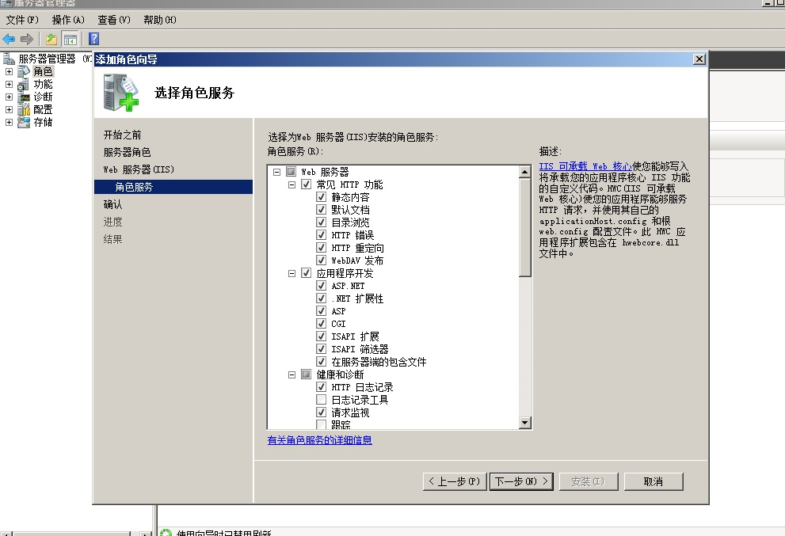
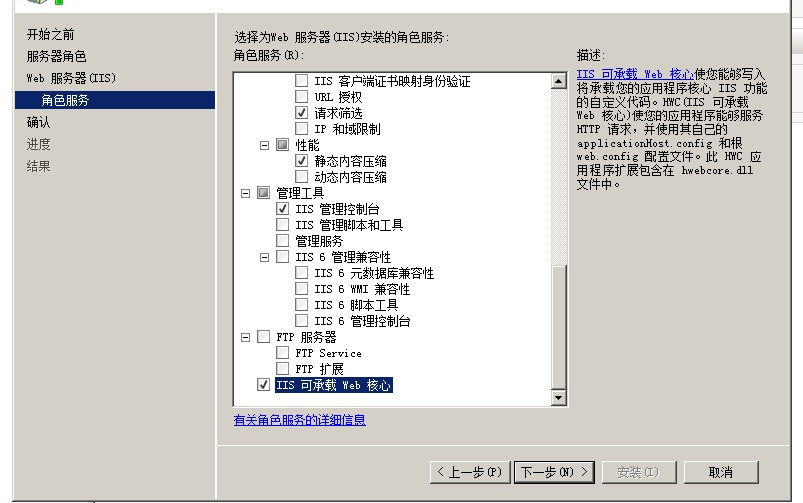
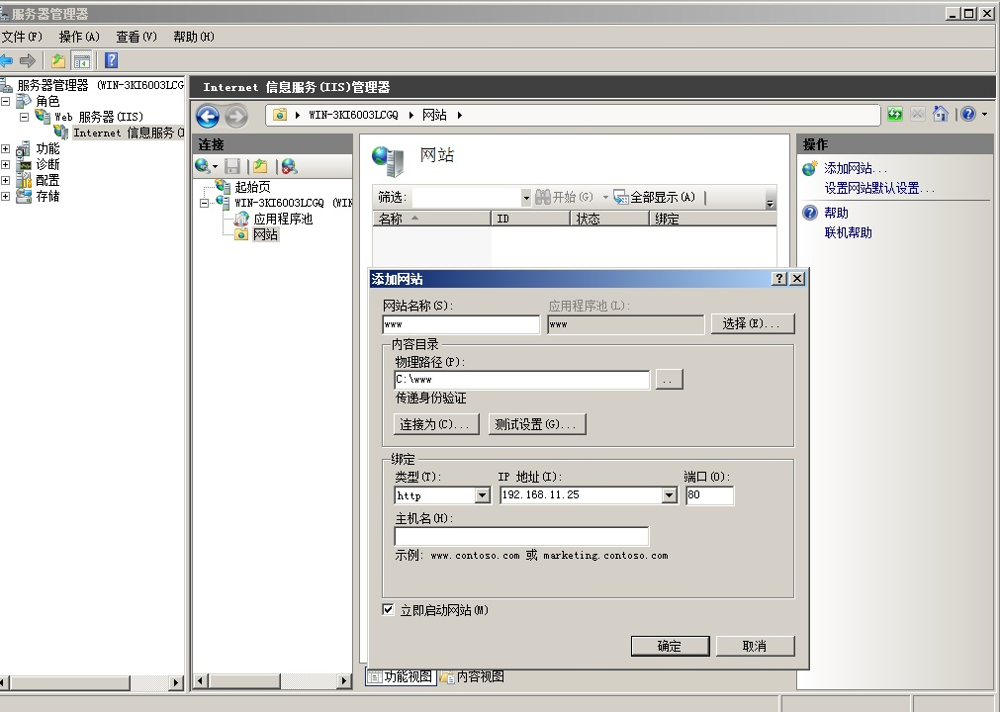
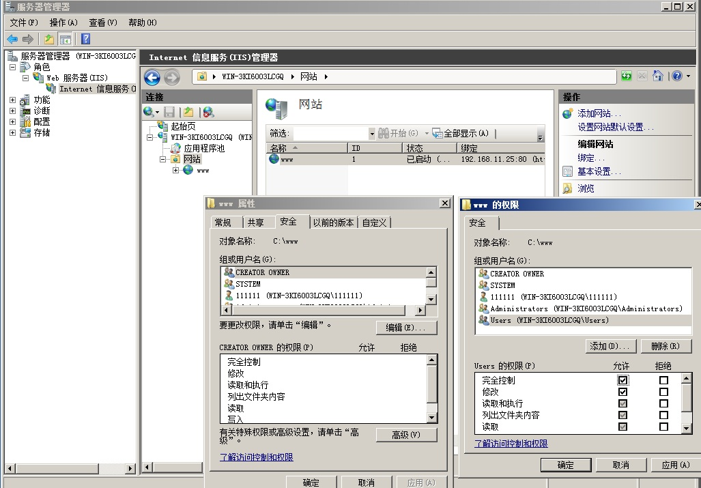
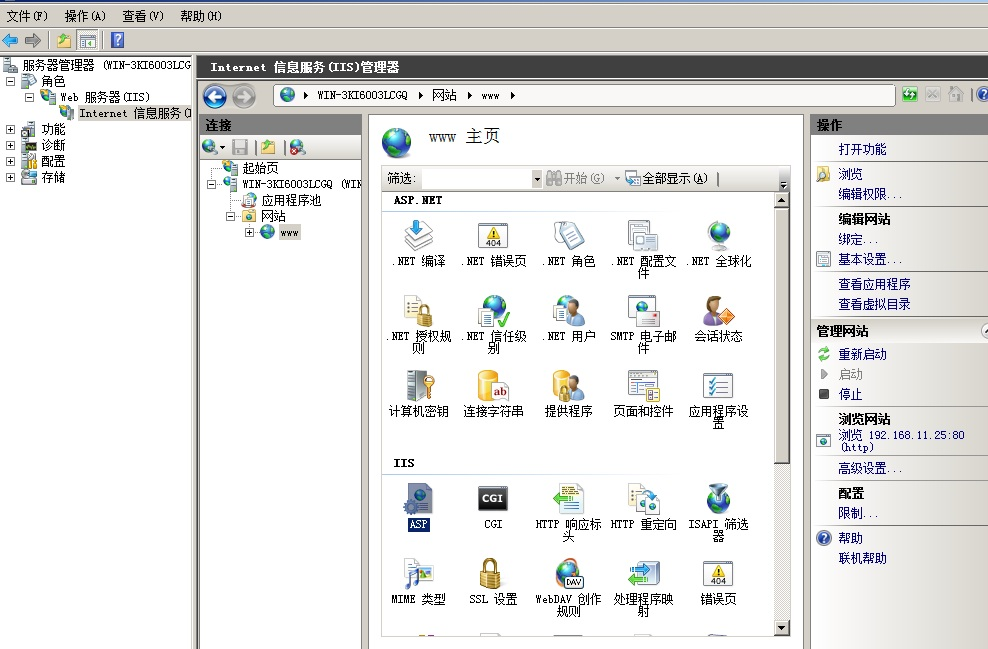
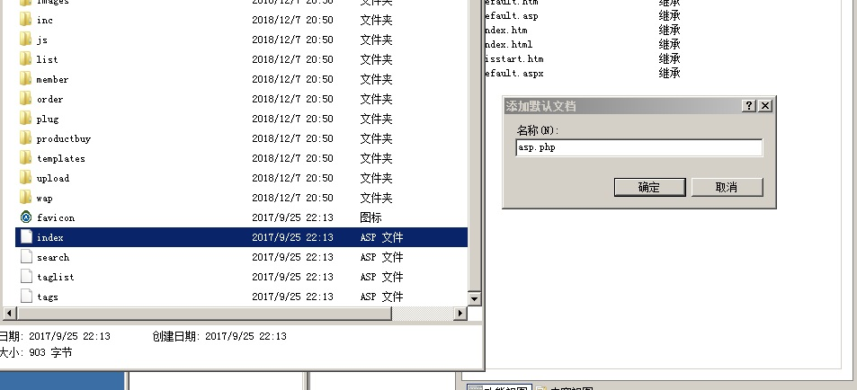
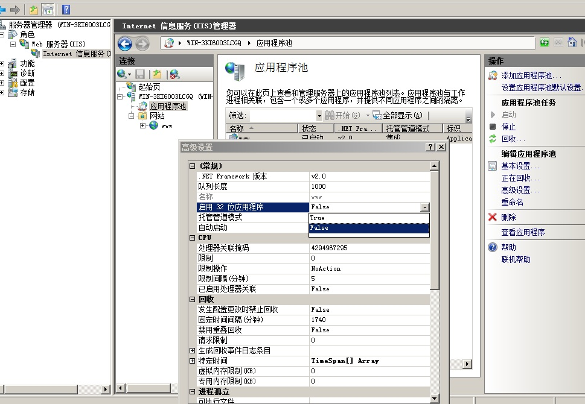
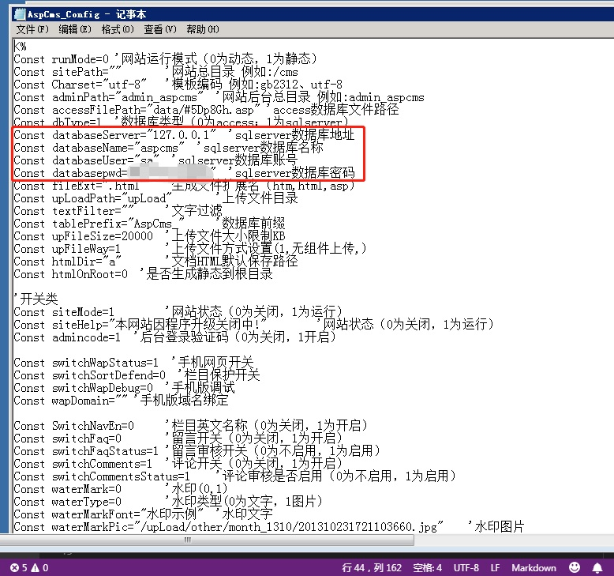

## 准备工作：首先在虚拟机中安装好windows server 2008 R2系统（64位），下载sql server 2008版本（64位）不用拉进虚拟机。

------
## 搭建网站：
    
1.进入windows server 2008，打开服务管理器----->添加角色---->添加web服务器------->勾选常见HTTP功能（需要后台的话还要勾选应用程序开发）、iis可承载web核心 ------>安装、完成即可；

2.导入网站源码（以aspcms为实验对象）在C盘创建个文件夹叫www，把源码复制进去；

3.在iis服务器中点右键选择添加网站。

--------
## 网站设置：

1.在iis管理器中找到自己刚建的网站右键“编辑权限”，------>安全------>编辑--------->给user赋予完全控制的权限；

2.iis管理器中找到“ASP”双击启动，更改“启用父路径”位“TRUE”；

3.iis管理器中打开“默认文档”，把刚才导入的网站执行文件名字导入(如果里面有了就不用了)；

4.iis管理器中的应用池----->基本设置改为自己想要的.net版本
                    ----->高级设置中把“启用32位应用程序”支持改为“true”

--------
## sql server安装：

1.用虚拟机cd加载sql server的镜像，选择“全新安装” 
        >功能选择：数据库引擎服务、
    
2.全新安装，一路下一步------->功能选择：数据库引擎服务、客户端工具连接、管理工具、sql客户端连接sdk-------->验证方式：混合模式，用户名sa---安装。

3.开始菜单-------> sql server management studio------->服务器名127.0.0.1、验证方式选择windows验证----->完成。

----------
## 把Access数据库文件导入sql server数据库：

新建一个数据库----->右键点任务------->导入数据-------->数据源选Access（导入文件在网站配置文件中能找到）--------->选择要导入的表和视图--------->修改配置文件。

